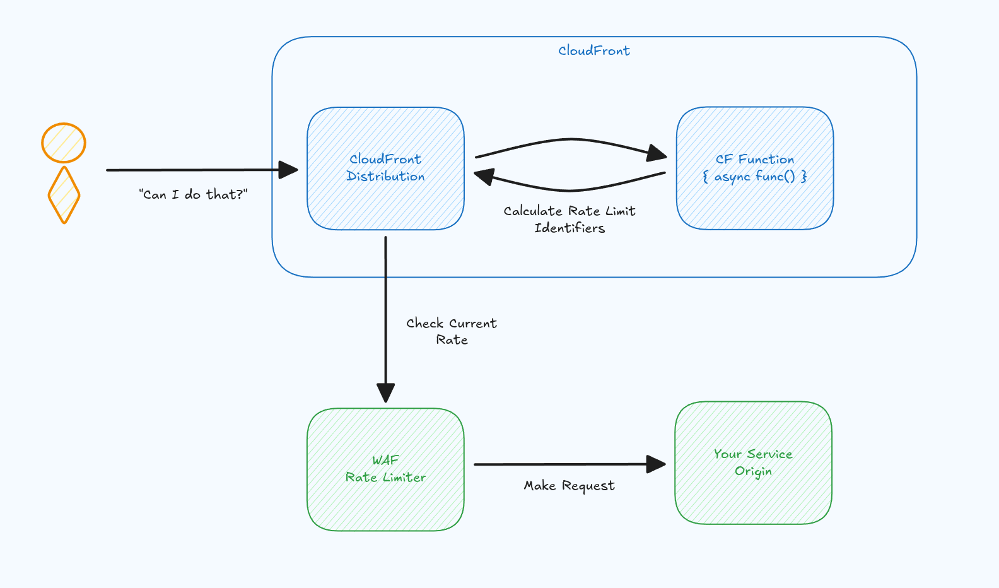

Full disclosure, it is still terrible. I don't promise it wouldn't be, just rather less terrible.

There are lots of bad ways to do this. I don't think there are any best practices unfortunately. Each comes with its own set of drawbacks.

:::warn
This is an article for those utilizing AWS in some capacity, and as such we can't avoid the elephant in the room, API Gateway. For the rest of the article, when I say `API Gateway`, I mean the `AWS API Gateway` product, abbreviated by `APIGW`. This is an unfortunate naming since there are architectural components called `API Gateways` and in reality, what APIGW provides, actually isn't that. But when I need to make a distinction, I will, by calling that out.
:::

## Why rate limiting matters

Realistically, you have an API. You always have an API, if you didn't you probably wouldn't be reading this article in the first place. Your API may be deployed behind APIGW using Lambda. Or maybe it's an ALB handling your TLS Termination for your containerized compute. At some point, you are going to figure out that you need rate limiting. It's not usually an **if**, but rather a **when**. And when that time comes, it's not per-IP or per authenticated account, but **per user** rate limiting.

Too often the advice in AWS is **"Throw a WAF at it"**. And that's not exactly wrong, but it's not the nuanced answer you're looking for either. What if you did do per-IP — would that really not work? What about somehow rate limiting on the JWT the user is already sending? I'll get to all of that and more.

But first, why do you even care?

Rate limiting solves a real business problem. And usually more than one. And the reason you need to be clear about which problem you're solving is that different motivations lead to different architectural choices, and most of the bad solutions out there come from not being specific about what you're protecting and most importantly **why**.

**Protecting expensive downstream resources.** Your API calls a database, a third-party service, or triggers compute that costs real money per invocation. One user hammering an endpoint can run up your [bill in minutes](https://chrisshort.net/the-aws-bill-heard-around-the-world/). Without rate limiting, your cost model is "whatever the most aggressive user decides to spend on your behalf." In the world of today, usually there is some threat actor, just desiring to use your [solution as a database](https://github.com/fr34kyn01535/discord-fs) or as pure compute.

**Maintaining your uptime SLA.** This is the one people underestimate. Rate limiting isn't just about cost or abuse, it's a real and vital [strategy for uptime](https://authress.io/knowledge-base/articles/2025/11/01/how-we-prevent-aws-downtime-impacts#helpful-rate-limiting). Blocking malicious traffic before it saturates your origin is what keeps your service viable for the users who actually matter.

**Enforcing fair usage across tenants.** In a multi-tenant system, you'll have shared resources. And one tenant over consuming allocated capacity will degrade the experience for everyone else. Rate limiting is the mechanism that prevents that.

**Protecting yourself from your own customers' bugs.** And not every spike is malicious. A customer could easily ship a mobile app with an infinite retry loop, or a misconfigured webhook fires on every event. Which then means, you're suddenly absorbing ten thousand requests per second from a single client. Your SLA doesn't care whether the outage was caused by an attacker or by one customer lambda-bombing themselves.

No matter where you go, rate limiting is not just a feature. Fundamentally, you will get to the point where it's required infrastructure that protects your system from what the outside world can throw at it. And the hard part isn't deciding you need it; but rather implementing it correctly without burying you with the mountain of cloud maintenance.

I don't know if this has been written before. But enough people get rate limiting with API Gateway wrong that another post on the topic can't hurt.

## AWS API Gateway Usage Plans

There are so many things wrong with AWS API Gateway (**APIGW**), such that this article could be dedicated to just that. But instead I've taken a different focus. But in order to that I still need to touch upon at least the relevant parts.

APIGW has two forms: `REST` (V1, Legacy) and `HTTP` (V2). V1 is called REST because it supports OpenAPI Spec v2.0 for model validations, has a notion of documentation, lets you automatically deploy a CloudFront distribution on top of your API, and does rate limiting using what they call [Usage Plans](https://docs.aws.amazon.com/apigateway/latest/developerguide/api-gateway-api-usage-plans.html).

In reality, `REST` is [3.5x the cost](https://aws.amazon.com/api-gateway/pricing/) of `HTTP` — $3.50/million vs $1.00/million. The world has moved onto the v3.2 version of the OpenAPI Spec. No one needs the built-in documentation, when portals like [OpenAPI Explorer](https://github.com/Authress-Engineering/openapi-explorer?tab=readme-ov-file#openapi-explorer) exist, and the APIGW CloudFront isn't a real CloudFront, you have no control over it, and thus don't get any of the benefits. And now I can finally get to usage plan part.

And perhaps the question is *What the heck are usage plans?*

I'm so glad you asked. I've seen many people reach for APIGW explicitly for the usage plans even if they're not otherwise using APIGW, for example when they are currently utilizing an ALB. The truth is, the only good usage of APIGW is for Lambda Functions. Custom Domains, Certificates, maybe mTLS — if you are using Lambda Functions. If you aren't using one, then you don't need APIGW, there is nothing it does, that it does well. That means there is nothing left which would justify any value by adding it to architecture, unless you are already using APIGW.

*"I couldn't have done X before, but with APIGW I can!" — Someone out there on the internet*

And that's true, but you could also do X with likely CloudFront, or directly in your compute or maybe even with the ALB, but please don't use APIGW otherwise.

*What about usage plans?*

Oh, right, I lost the point.

### What usage plans are and how they work

The mental model is straightforward. You create a [usage plan](https://docs.aws.amazon.com/apigateway/latest/developerguide/api-gateway-api-usage-plans.html), which defines a throttle (rate + burst) and an optional quota.

```
Usage Plan "Standard Tier"
├── Throttle: 100 requests/second, burst 200
└── Quota: 50,000 requests/month
```

And then you create an "API key" and attach them to the plan. An API Key isn't actually an API key, it just what APIGW decided to use its infinite wisdom to call an **instance** of the usage plan. It's the mapping of the usage plan to the user in question you want to rate limit. The problem is "How do you assign this mapping?"

APIGW usage plans work by letting you first create "API Keys", assign the key to a usage plan, and then later when a user interacts with your API, for every request you tell APIGW which API Key is being used.

More specifically:

```
Usage Plan "Standard Tier"
├── Throttle: 100 requests/second, burst 200
├── Quota: 50,000 requests/month
├── API Key: user_001  ← attached
├── API Key: user_002  ← attached
└── API Key: user_003  ← attached
```

So for instance, when the user with JWT `sub` user_001 shows up at your API, you can tell APIGW that it should find the usage plan attached to the API Key `user_001`. You convey this critical information to APIGW via a custom lambda authorizer. You could also do this ridiculous thing of completely discarding any notion of security and asking the user to send you their API Key in a custom field and using that to key off. But I wouldn't recommend it. (It's worth noting this is probably what the original APIGW developers had in mind when they created it, but we know API keys are insecure by design, I've extensively covered that in how [machine to machine authentication works](https://authress.io/knowledge-base/academy/topics/how-does-machine-to-machine-auth-work).)

```js title="Example authorizer implementation"
import { ApiGatewayClient } from 'aws';

async function authorizer() {
    return {
        principalId: 'user_001',
        usageIdentifierKey: 'user_001'
    };
}
```

This seems perfect for per-user rate limiting. Create an API Key with the same value as the user's `sub` / user ID. Assign it to a plan. Done.

It's not done.

### Hard limits on usage plan keys

Usage plans have a hard cap on the number of API keys: [10,000 per account per region](https://docs.aws.amazon.com/apigateway/latest/developerguide/api-gateway-execution-service-limits-table.html). This is not adjustable. You cannot request an increase. I'm sure there is some amount of money where that isn't true in practice. But, it's fun to think about hard limits as actually being unmovable, and you probably have better things to do than praying that some poor TAM will help you with your support case.

Now, you may be thinking: "But I only have 1,000 users." However, you need to look at this from a business perspective, not a technical one. To be successful you might only need 1,000 paying users. But if your churn is around 50%, that's 500 churned keys per year. Sign-ups that don't convert can easily be another 500–1,000 per year depending on scale. Which means in a few years, and it only takes one good ad campaign, your limit of 10,000 is completely insufficient.

There is an exception here potentially for business customers. For B2B apps, you wouldn't likely be using the user ID as the key anyway, you'd use the business account ID. Which means, you'll likely have at least one factor of magnitude fewer account IDs than consumer user IDs, probably even fewer. So this solution may actually be sufficient for those scenarios. All the other limitations unfortunately still apply.

For consumer apps, the user ID as the plan key violates the scaling needs of any real user base. And for most business apps as well.

### The bootstrap problem

Forgetting about the hard limit, doesn't alleviate all our issues however. Another obvious one that will immediately come up is that there is no `Default` Rate Limit. Once you enable a Usage Plan for an API, every request needs to be coupled back to a usage plan. That means there must be an API Key created for that user.

Here lives a paradox. API calls require API Keys, but you won't know to create the API Key without there first being a call to your API. This leaves a couple of possible solutions:

#### Option 1: control plane API

Utilize the APIGW control plane to check if an API Key exists in your custom lambda authorizer. If it doesn't exist, you can use the control plane to associate the api key with the right usage plan at that moment. The APIGW hard limit for [CreateApiKey](https://docs.aws.amazon.com/apigateway/latest/developerguide/limits.html) is [5 RPS per AWS Account](https://docs.aws.amazon.com/apigateway/latest/developerguide/limits.html). So there is no way you are going to be calling this directly in your authorizer for every request.

Thankfully we don't have to, but the GetApiKey api isn't even documented there. So we have no idea what that means. Assuming the rate limit is at least some multiple of CreateApiKey, still leaves us with a situation where we will end up getting throttled in the Lambda Authorizer when we call the APIGW control plane.

You might be thinking, well it's okay, but remember why we created this in the first place. You will end up getting throttled to your APIGW control plane at the exact moment where you are also getting spammed and need rate limiting to work. Not a great story.

Now, you could attempt to turn on Authorizer Caching to ~once per hour, and hope this reduces the load on GetApiKey down enough to provide breathing room. In reality that is going to provide only limited value.

```js title="Authorizer: Just in time api key provisioning"
import { ApiGatewayClient } from 'aws';

const apiGatewayClient = new ApiGatewayClient();

async function authorizer() {
    const userId = 'user_001';

    const apiKey = await apiGatewayClient.getApiKeys({ nameQuery: userId, includeValues: true, limit: 1 });
    if (!apiKey.items.length) {
        const apiKey = await apiGatewayClient.createApiKey({ name: userId, value: userId });
        await apiGatewayClient.createUsagePlanKey({ keyId: apiKey.id, usagePlanId });
    }
    
    return {
        principalId: userId,
        usageIdentifierKey: userId
    };
}
```

It's doable like this, but it isn't great. In essence it doesn't really fix the problem, you've just moved it somewhere else. It feels like it works, but remember, that this has the issue that we are creating a strategy that allows anyone to abuse your API just by creating new accounts. So in practice generating API keys and attaching them to usage plans isn't a real rate-limiting strategy. We want to actually block new accounts from getting automatic api keys.

There's also two subtle bugs in the above code. What happens if the api key is created, but is never attached to a usage plan? We'll have a critical failure for that user. This could happen and for sure will happen to any user who attempts to sign up while you are having an incident. The second is that on every call you are going to be slowing down your authorizer by calling a control plane, and one that was not designed to handle this exact thing. Want to slow an authorizer by multiple seconds and definitely get rate limited yourself? Not very sustainable.

One more thing on authorizing caching. Authorizing caching is extremely dangerous in its own way, since you might be allowing expired tokens to still be used with your API. API Gateway Authorizer caching doesn't know to automatically expire the cache when the token expires! However, focusing on our use case, Cache TTL does reduce calls, but the first request per user per cache window still hits the control plane.

Some quick math: if you have 5,000 active users and a cache TTL of 5 minutes. When the cache expires every ~5 minutes, that amounts to 1,000 control plane calls per minute (17 RPS), just for the "does this key exist?" check. Under traffic spikes, which are the exact scenario you're rate limiting for, cache misses increase. More unique users — means more control plane calls — means you're DDoSing the APIGW control plane while trying to prevent a DDoS on your API. At any sort of scale this isn't going to work in the first place, even theoretically.

So let's move on.

#### Option 2: Pregeneration

I personally hate this next strategy, but I know for some things people love it. To completely side step the problem of having to generate the usage plan api key and attaching it to the usage plan *in the authorizer*, while the user is actively making a request, you can pregenerate some keys.

But that's where this falls down a bit, how many should you generate, how do you know to generate more, what should you even do with those keys.

I think the whole usage plan thing is a lost cause, but I'll try to provide some guidance for strategy, just in case it's the one you decide to end up going with.

First of all, of course it's easy to generate some usage plan api keys and store them in a DB somewhere. I don't know if storing the keys in a DB is better than generating them at runtime in the authorizer. But if it is, you are swapping "generation" using the API Gateway API for "generation" using your own "API", which is probably just a query to a database. You might end up with some race conditions there on which key should be selected and given to whom.

Another thing to be cognizant of, is who will own that key. See, keys aren't really owned by anyone. There is no way to assign keys to individual users (how would that even work?), and for sure not before you even know who the user is. So at what point do you give the user key, and what is the key value?

In the **Option 1** strategy above and the **Option 3** strategy below, we're assigning keys to users based on the assumption that the api key exactly matches the user ID. But if it doesn't, how does the user even get the key in the first place in order to call your API?

The trivial answer is: *They call a dedicated endpoint, and that returns them the key*. Well that doesn't really make sense because it completely duplicates the problem that this Option was supposed to solve in the first place. Maybe there is a smarter answer here, but I honestly don't know what that would be.

The non-trivial answer is: *When users sign up, decide ahead of time what their user ID will be, so that you know also ahead of time what the API Key will be.*

That's also not really a solution, because it requires coupling your sign-in process to your API Key generation process, and that might not even be something for which you are fully in control.

The last thing that comes to mind for this solution is a long term problem. Users can "buy" keys. Since keys aren't coupled to users, they can sign up multiple times, get multiple keys and rotate through them to call your APIs. Since you do no sort of validation to make sure the user is using the right key.

But this brings up another point. Where are users supposed to save their API Key? If we don't know who the user is before they call our API, then we can't create an API Key that can be determined from their user ID. That means the key value will be different from their user ID. If it is different then it needs to be available somewhere for the client to store. Someone has to be responsible for storing it somewhere. I suppose one thing you could do is maintain a list of user IDs to api key mappings in your database and create an endpoint called `GET /user-api-keys` returning a list of api keys available for the user, so that they can use that key for followup requests. Again at that point, you'll have an endpoint to return a key, might as well side-step that completely and just assume the key is the same as the user ID, and not bother even storing the keys in the first place.

#### Option 3: Account Creation

One genius thing you probably already thought of to solve the above problems is — *what if we create the usage plan api key during account creation instead?*

Genius!

To do that, you could rate limit all your endpoints without issue, except for the Account Creation one. Right?

Wrong!

Users will create accounts through your UI. When they do that, they will likely need to load a bunch of data from your service, which would enable them to understand exactly how to do that. So in practice you'll have more than just the `POST /accounts` API that needs to be completely exposed. Of course you'll still have an authorizer on there to validate incoming JWTs, but rate limiting would be an unsolved issue, and rate limiting with the same API Key as the one for all other endpoints would be impossible. (Because the API Key wouldn't exist when those account creation endpoints are called.)

Remember, you probably still are caching the authorizer result, so that you don't need to fetch an OAuth JWT-public key lists to validate tokens. But at that same time this means you baked in the result of the authorizer into the cache. And that cached result says "No API Key available".

Wait, why is that again?

How do you know to call `POST /accounts` in the first place? Well of course you know because first you called `GET /accounts`. Is `GET /accounts` rate limited? Is it rate limited using the same authorizer as your "account creation endpoint" authorizer or your "all other endpoints" authorizer? Depending on which authorizer you used, you might have already determined which endpoints were acceptable to be called and with which rate.

Also you have a secondary problem here, is your account creation flow async? I know ours is. Which means that API Key might only be created minutes from now, but the user is sitting on the UI with a little spinner waiting for the account to be created.


One trick that sort of works is in your authorizer, is turn on caching, but also, look up the mapped user or B2B customer account in your database. If that account was just created in the last 5 minutes, give them a limited use API Key, otherwise use an API Key dedicated to their account.

This shifts the burden from your API resources (your backend origin compute) to a custom Lambda authorizer that interacts with a database in a cached way. Depending on your needs you can also get pretty fancy here, but I wouldn't recommend it. The whole point is a hack to get these new users a temporary key that works, but long term isn't the key that they'll be using for 100% of their requests.

This avoids the unlimited fallback plan that would be a new security hole, and side-steps building a rate limiter with a bypass for the exact users you can't yet identify.

```js title="Authorizer for recently created users"
import { DynamoDB } from 'aws';

const dynamoDBClient = new DynamoDB();

async function authorizer() {
    const userId = 'user_001';

    const account = await dynamoDBClient.get({ TableName: 'account', userId });
    const accountWasRecentlyCreated = account.createdTime < now.minus({ minutes: 5 });
    
    return {
        principalId: userId,
        usageIdentifierKey: accountWasRecentlyCreated ? 'Temporary-Usage-Plan-Key' : userId
    };
}
```

### Usage Plans in practice

And that works ... sort of. The API surface for managing usage plans is painful. And not the normal kind of painful. It's the kind where you realize the API was designed for manual console clicks, not programmatic management.

A key can be associated with up to 10 usage plans simultaneously. Yay, you might think, but actually only one usage plan applies per API stage. So if you need to change a user's tier, for instance to move the user or account from **"Standard"** to **"Premium"**, you have to:

1. Call `DeleteUsagePlanKey` to remove the key from the old plan
2. Call `CreateUsagePlanKey` to add it to the new plan

Two separate API calls. No transaction. No atomicity. Between step 1 and step 2, the key is unassociated — meaning the user has no access at all. Under load, that window matters.

With caching, the window matters less, but at a scale where rate limits are a responsible strategy, this feels like an irresponsible solution. While you aren't going to be doing this every day, the users who will be most affected are those who are your high frequency users.

Said differently, users that require a higher rate plan, that want to pay you for that, require you to temporarily delete their usage plan, so that you can upgrade them. Good Luck!

#### Quotas

Another area that is a straight pit of failure are the usage `quotas` that come with the usage plans. The rate-limiting part is nice, but you're encouraged to also set a fixed quota for resources. And it sounds like a very convincing idea!

However, you'll soon find out that these quotas only reset at the end of the day or month. Which seems incredibly arbitrary. But it's worse. As you are encouraged to set them, what happens in practice is that some user will use up all of the quota. Success!

When that happens, they are blocked, just like we wanted. However, now comes the problem, is that really what you want? You probably have a much better business strategy in play.


But **the profit** in this case is — that user pays more. There are two problems with this:

1. You are likely blocking critical production access to your API, since the quota is consumed.
2. Because the quota is blocked you are likely also blocking the access to your API to allow them to pay and increase the quota.

What you have done here is introduced a technical solution to a business problem, where in reality these are completely separate concerns. But, I'll get more into this later, in the [Do you really need rate limiting section](#is-rate-limiting-required).

### Endpoint cardinality

You'll be happy to know, you *can* define per-method throttle overrides — `GET /items` at 100/s, `POST /items` at 10/s, scoped to specific resource + method combinations within the plan. Sometimes, if you are lucky the API will even allow specifying 0.1/s or slower, but often it will complain.

And so, usage plans do support per-method throttle overrides. You can set different rates for `GET /items` vs `POST /items` at the resource + method level within a plan.

But the problem in practice is that every user on the same plan gets the same per-method limits. If you want user A to have different endpoint limits than user B, you need different plans. It's likely that the combinatorial explosion of users × endpoint tiers makes this unworkable for anything beyond a handful of static tiers. And each of your plans will end up looking like:

```js title="Usage Plan configuration"
{
    Type: 'AWS::ApiGateway::UsagePlan',
    Properties: {
        UsagePlanName: 'TIER1',
        Throttle: {
            BurstLimit: 100,
            RateLimit: 20
        },
        ApiStages: [{
            ApiId: { Ref: 'ApiGateway' },
            Stage: 'production',
            Throttle: {
                '/v1/records/GET': {
                    BurstLimit: 1,
                    RateLimit: 1
                },
                '/v1/accounts/POST': {
                    BurstLimit: 1,
                    RateLimit: 0.000001
                }
            }
        }],
        Quota: {
            // Since quotas only reset once a full day,
            //   it's going to be pain everywhere when a customer hits it.
            // Instead we'll just pick something really really high.
            Limit: 70000000,
            Period: 'DAY'
        }
    }
},
```

What you actually want instead is per-user-per-endpoint granularity, which of course would require one plan per user per endpoint configuration. And to be able to dynamically update this based on their pricing plan and expected usage. That's not rate limiting, that's a whole plan management system.

### The usage plan verdict

I don't really understand the world where the usage plans architecture makes sense, so it isn't one I've been able to justify. To use it for actual rate limiting is building on a foundation that fights you at every step: hard limits, non-atomic updates, a terrible API, and a bootstrap problem that creates the exact hole you're trying to close.

It explains a lot when you understand that Usage Plans only exist for the legacy APIGW V1, and don't exist in V2. It's a good indicator to remember, if it doesn't exist on HTTP APIs you likely should think twice before going to production with it.

## Rolling your own rate limiter

So, Usage Plans are out. The next place most people land is: build the rate limiter yourself. Do they, do they really? Everyone's got to know that building it yourself is rife with no shortage of challenges. But we can't exclude that there might be an actual good reason for the 0.1% use cases. So let's review it as a potential solution. Which reduces to:

> **Store a counter somewhere, increment it on every request, block if exceeded.**

How hard could it be?

In a traditional server architecture, you could keep counters in memory. Nginx does this. Envoy does this. Rate limiting is a solved problem when you have a process that lives long enough to count. This requires legacy infrastructure coupled with fixed compute and a centralized reverse proxy layer to filter all requests through. We know fundamentally this isn't scalable.

And if you're running Lambda, or another kind of compute or containers that are stateless, then this will likely immediately break down. In production, you might have hundreds or thousands of instances running concurrently, each with no knowledge of the others. There is no shared memory. There is no "the server." Every invocation is an island.

With a small number of instances, you could just have a decentralized handling in each instance. Sure, that rate limit of 100 requests per second with three instances effectively becomes 300 requests per second. But that won't really impact your infrastructure that much.

Getting back to it, we need a counter store. Something external that all your instances can read and write atomically. In AWS, there are two realistic options.

1. **[DynamoDB](https://docs.aws.amazon.com/amazondynamodb/latest/developerguide/WorkingWithItems.html#WorkingWithItems.AtomicCounters)** gives you atomic counters via `UpdateItem` with `ADD`.

2. And [ValKey](https://valkey.io/) (formerly Redis) gives you [`INCR`](https://valkey.io/commands/incr/) with a TTL. 

Both are battle-tested primitives. Both do exactly what you need for this problem.

Sort of.

This approach genuinely has advantages. You're in full control. You can set whatever limits you want, per user, per endpoint, per whatever custom dimension makes sense for your business. No hard caps on API keys, no bootstrap paradox, no APIGW control plane throttling. And your architecture configuration is completely independent. It doesn't matter if you are running a single compute instance or hundreds of thousands of them. (Well, it sort of does, as you will need to also scale up your counter store).

Then you deploy it.

### Problem 1: Every request pays the tax

Even if we throw out the complexity of managing this technology, where do we deploy it, what is the schema, how do we integrate with it, when do we upgrade, how do we gracefully fallback ... The first thing you'll notice is latency. Every request, not just the ones you want to block, *every single one*, now has a mandatory round-trip to your counter store before it does anything useful. One of the worst mistakes inexperienced architects make is creating a solution that solves for an edge case by degrading the most common use case. It's only the edge case that should be affected by complexity, but here is it, everyone.

For DynamoDB in the same region, that's roughly 5–10ms. For ValKey, maybe 1–2ms. These aren't catastrophic numbers. But they're on every request. Your best customer making 10 requests per minute is paying the same latency tax as the abuser making 10,000. You're taxing 100% of your traffic to protect against the fraction that's problematic.

### Problem 2: Cost

Then there's the cost. Using these resources isn't free, and as you scale, you'll need to scale this solution. While you might be able to get something interesting out of the same stack (e.g. use ValKey for a second purpose), you've essentially added a critical path component to your service, product, API, which is load bearing.

DynamoDB: every counter update is a write request unit. An attacker at 10,000 requests per second means 10,000 writes per second to your counter table — [864 million per day](https://aws.amazon.com/dynamodb/pricing/on-demand/). You're burning DynamoDB write capacity on the counter store to prevent the attacker from burning compute on your API. The rate limiter itself becomes a denial of wallet attack surface.

ValKey: great performance, but now you have a stateful cluster in your "serverless" architecture. ElastiCache nodes to size, failover to configure, [connection pooling in Lambda](https://docs.aws.amazon.com/lambda/latest/dg/configuration-database.html) to manage. You went serverless to not manage infrastructure, and now you're managing a Redis cluster because you needed a counter.

If you have thousands of instances of your compute, you will need a cluster that can handle thousands of concurrent connections to your store of choice. Are you starting to love this solution?

### Problem 3: Edge cases

There is a lot I'm going to overlook in this section, not because they are annoying to talk about, but because I don't think they are important. If you are pedantic, you can consider:

* The complexities of race conditions with your atomic store?
* Does 10 RPS mean 10 PRS max, average, burst, or best effort?
* What about when your store goes down, do you fail open or close? How do you even write that code?
* Does your storage of choice even support the scale you need? Before we were looking at compute, but now we've shifted the concern to your Rate Limiting implementation. How are you going to avoid making your rate limiter your service bottleneck?

In a lot of cases you probably took a very nice and simple distributed compute system, centralized it, and created a huge single point of failure.

### Problem 4: The devil

And it's always in the details. I haven't even started talking about the implementation, so let's get to that. How do you even implement this in practice?

Above I alluded to using `INCR` or `ADD` in a database request. For simplicity, let's assume you are using DynamoDB here. Hopefully the complexity of the implementation will immediately become clear.

One person is going to jump up and down say say:

```js title="DynamoDB Increment"
async function rateLimitCheck(userId) {
    await dynamoDbClient.update({
        TableName: 'RateLimits',
        Key: { PK: 'UserId' },
        UpdateExpression: 'SET #counter = if_not_exists(#counter, :zero) + :one',
        ExpressionAttributeNames: {
            '#counter': 'counter'
        },
        ExpressionAttributeValues: {
            ':zero': 0,
            ':one': 1
        }
    });
}

```

But that's just going to increase monotonically to the maximum value supported by DynamoDB, which I don't even know off the top of my head. Let's assume it is some NodeJS implementation support for MAX_INT or BIG_INT, but even then, that's probably wrong.

And that's not even the worst part. How do we check that if a user is consuming **more than 10 per second**?

For kicks, I gave this problem to Gemini to see what hot garbage it returns (and spoiler alert not only was it wrong it was also in python):

```python title="DynamoDB incorrect rate limiting"
table.update_item(
    Key={'PK': user_id},
    UpdateExpression="SET req_count = if_not_exists(req_count, :zero) + :inc, ttl_attr = :ttl",
    ConditionExpression="if_not_exists(req_count, :zero) < :limit",
    ExpressionAttributeValues={
        ':inc': 1,
        ':zero': 0,
        ':limit': 10,
        ':ttl': current_second + 60 # Expire after 1 minute to save space
    }
)
```

This doesn't work for so many reasons, I think the biggest reason is that it hinges on the fact that after the TTL is over the data will be wiped, but DynamoDB doesn't work like that. TTL doesn't guarantee the data is gone after that point. So if a user reached the rate limit yesterday, there might still be a value of 10 sitting in the DB. We could add some code to deal with that case, but you are far better off asking for a `Token Bucket Algorithm`.

```js title="Token Bucket Implementation"
async function rateLimitCheck(userId) {
    await {
        TableName: "RateLimits",
        Key: { PK: userId },
        UpdateExpression: `
        SET lastRefillTime = :now, 
            tokens = (if_not_exists(tokens, :cap)
              + (:now - if_not_exists(lastRefillTime, :now)) * :rate),
            tokens = (if_not_exists(tokens, :cap) > :cap ? :cap : tokens) - :one
        `,
        ExpressionAttributeValues: {
            ":now": Math.floor(Date.now() / 1000),
            ":rate": 10,
            ":cap": 10,
            ":one": 1,
        },
        ConditionExpression:
          `(if_not_exists(tokens, :cap)
            + (:now - if_not_exists(lastRefillTime, :now)) * :rate) >= :one`
    };
}
```

Okay, also Gemini failed again, except this time it tried to write just a completely invalid DynamoDB Expression. Do you see it? There is no `?` ternary operator in DynamoDB...

You also can't set the value twice, that doesn't work. And another problem that you might find is that expressions within the SET can be executed out of order. So you can't assume order of operations.

You can play around a lot with this, and I guarantee you there is a way to achieve this, but the expressions above are not it.

And while I can share with you how to do this, and there are some quite clever things about how we have implemented interesting DynamoDB logic to explicitly [handle metrics tracking](https://dev.to/aws-builders/idempotency-in-dynamodb-4leh) in Authress, the truth is we already know that this solution does not scale, and it's very difficult to get this logic right in the first place.

The core aspects of the solution require:
* storing multiple values for multiple timestamps and ranges
* handling missing rows from the DB
* read before write
* DynamoDB Lists / Arrays

Fundamentally, you'll want to increment a set of values for the user, return all the data, then aggregate and decide what to do in the authorizer.

Authorizer? I never really talked about where you would even run this code. You need a full list of all the requests coming into your service, but your authorizer is likely caching. Which means the authorizer can't do it, since it will only see 1 request / TTL, and not all of them. So that means it is happening in your service. And if that's the place this is happening that means your APIGW and Lambda (or your container service) are getting the full request and processing at least part of it before returning. That's going to consume more resources, potentially defeating the purpose of Rate Limiting in the first place.

## The custom gateway alternative

At this point, you might be thinking: forget AWS-native solutions, I'll just throw a reverse proxy in front of my API. There's got to be something out there that handles this out of the box. And there are:

* [Nginx](https://docs.nginx.com/nginx/admin-guide/security-controls/controlling-access-proxied-http/)
* [Traefik](https://doc.traefik.io/traefik/middlewares/http/ratelimit/)
* [Envoy](https://www.envoyproxy.io/docs/envoy/latest/configuration/http/http_filters/rate_limit_filter)

All have rate limiting built in. Battle-tested with various degrees of documentation, widely deployed, for the most part. This is a solved problem in the non-cloud world.

If you have a fixed fleet of servers sitting behind a load balancer, cloud or not, a reverse proxy with rate limiting works beautifully. The proxy sees every request, keeps counters in memory, and blocks or passes in microseconds. No external counter store, no latency tax, no DynamoDB bill.


And in fact, you're in AWS. So the question is: where do you deploy this thing?

Do I really need to iterate through all the bad options? I can't think of any way to not ruin a good thing by adding this to the stack. I think the truth is, it isn't something that you can add in, you need to fundamentally replace APIGW to make it work. And if you are replacing APIGW, your compute still needs something to serve HTTP and terminate TLS.

Your options then are using an ALB, opening your EC2 up to the entire world, or running in EKS (yuck, I can't believe I said that). And as a result I'm going to claim there is no solution. If you do have a solution to this, please let me know. In any case I'm skipping over this section entirely, and moving on.

The truth is, there is no simple way to make this work, and no way to make it work without throwing away core benefits to running in the cloud in the first place.

## Making progress: AWS WAF

So if you can't do it in APIGW, can't do it in your own code, and can't do it with a custom proxy — what's left?

Apparently: **"Throw a WAF at it."**

And it's not wrong — [AWS WAF](https://docs.aws.amazon.com/waf/latest/developerguide/waf-chapter.html) can be [attached to almost everything](https://docs.aws.amazon.com/waf/latest/developerguide/how-aws-waf-works-resources.html) that receives HTTP traffic:

- [API Gateway REST APIs](https://docs.aws.amazon.com/apigateway/latest/developerguide/apigateway-control-access-aws-waf.html)
- [Application Load Balancers](https://docs.aws.amazon.com/elasticloadbalancing/latest/application/load-balancer-integrations.html)
- [AppSync GraphQL APIs](https://docs.aws.amazon.com/appsync/latest/devguide/WAF-Integration.html)
- [CloudFront distributions](https://docs.aws.amazon.com/waf/latest/developerguide/cloudfront-features.html)

That's pretty broad. And WAF evaluates rules before the request reaches your origin — which means it can block traffic at the edge, before you pay for compute. It has [rate-based rules](https://docs.aws.amazon.com/waf/latest/developerguide/waf-rule-statement-type-rate-based.html) which look promising and it has [aggregate keys](https://docs.aws.amazon.com/waf/latest/developerguide/waf-rule-statement-type-rate-based-high-level-settings.html) that let you group requests by custom dimensions. It sounds like exactly the right tool for per-user rate limiting.

It isn't.

So of course we need to review why not.

### WAF Rate-based rules

Rate Based rules allow you to aggregate on incoming requests properties, and use those aggregate to block requests. For the most part, this is fire and forget, you don't think about users, you don't think about endpoints, and often you don't even think about APIs or services.

And that's sort of the problem, it's great for blocking threat actors and malicious attacks as [I have talked about at length](https://authress.io/knowledge-base/articles/2025/11/01/how-we-prevent-aws-downtime-impacts#helpful-rate-limiting). But it's just not great when you need granularity. And that's for a few different reasons.

The goal of rate limiting is to restrict access to our resources, our endpoints, and our services as much as possible without getting the compute origin backend involved. Another problem is that actually the WAF cannot even be attached to the AWS APIGateway HTTP API V2. Unfortunate. But even if we could, we will see some problems with that as soon as we get to the implementation.

So let's try it out.

### Examples

Here's a starting example that helps make it clear how rules work. Let's rate limit by user IP address:

```js title="IP Address Based Rate Limiting"
{
  Name: "PerIPPerEndpointRateLimit",
  Priority: 1,
  Statement: {
    RateBasedStatement: {
      Limit: 600,
      EvaluationWindowSec: 60,
      AggregateKeyType: "CUSTOM_KEYS",
      CustomKeys: [
        {
          IP: {}
        },
        {
          UriPath: {
            TextTransformations: [
              {
                Priority: 0,
                Type: "NONE"
              }
            ]
          }
        }
      ]
    }
  },
  Action: {
    Block: {}
  }
}
```

So this is nice and likely handles almost all of the scenarios you might run into. It allows for 600 requests over 60 seconds. Which means burst handling is included.

But then where the usefulness ends. You know how we might want to have different rates for different endpoints?

We'll there are three problems that fall out of here:

1. The WAF is decoupled from our application, so it doesn't understand that `GET /orders/order_001` has the same route as `GET /orders/order_002`, and they are both really `GET /orders/{order_id}`. There is no way to bridge this gap. It may or may not be your desired state.

2. The second problem, which you might have guessed is that WAFs have a rule capacity. Not surprisingly as all of these rules need to run on every request. If you don't hit one of the other [rate based rules limit quotas](https://docs.aws.amazon.com/waf/latest/developerguide/limits.html), then you surely will hit the rule limit of 5000 Web ACL Capacity Units (WCU). I tried the next one, and it came out to be 62 WCU. Which means we would get about 80 rules, and that after all the other things you might want to throw in there. From our production environment, we are using ~164 for one of them. Which means we would be allowed 60 rules. There is such a thing as [WAF Rule Scope-Down statements](https://docs.aws.amazon.com/waf/latest/developerguide/waf-rule-scope-down-statements.html), but I don't know how much that would help in practice here. It isn't the same as endpoint transparency you would get with an application level solution.

3. Even if we somehow managed to get around the first two things, here's the kicker, we don't want IP an address. Hopefully it is obvious why. But if not, let me clue you in. Are you building a solution where you will have customers or users connecting from the same location? Physical address? Or Business address? Businesses usually have a small fixed set of available IPs, demand to allowlist small IPv4 CIDR blocks, and heavily reuse them. Or maybe you have a client that is using a cloud provider or VPN where addresses are being shared.

For this last one, maybe that's all a feature and not a bug. But if you are like me, this isn't really the right approach, and want some more robust and more importantly **more accurate**.

For users, you probably want to at least switch over to the JWT that is being sent. And we can do that by making this change:

```js title="WAF Authorization Rate Limiting"
{
  Name: "PerUserPerEndpointRateLimit",
  Priority: 1,
  Statement: {
    RateBasedStatement: {
      Limit: 600,
      EvaluationWindowSec: 60,
      AggregateKeyType: "CUSTOM_KEYS",
      CustomKeys: [
        {
          Header: {
            Name: "Authorization",
            TextTransformations: [
              {
                Priority: 0,
                Type: "NONE"
              }
            ]
          }
        },
        {
          UriPath: {
            TextTransformations: [
              {
                Priority: 0,
                Type: "NONE"
              }
            ]
          }
        }
      ]
    }
  },
  Action: {
    Block: {}
  }
}
```

And that's great, and works for the most part. If you are happy with it, then I'm happy for you.

But I'm not happy with it, because tokens expire, and furthermore users might have multiple tokens generated in different ways for any number of reasons.

I want to caution that none of the WAF configuration I'm talking about here has anything to do with malicious threat actors. They require a completely different perspective when being dealt with. The goal up until this point is simply to prevent users from accidentally using too much of our service, in a way that we would expect. Like clicking refresh too many times, or sending too many emails, and not attempting to bypass our rate limiting.

So utilizing the authorization token header isn't great. And as a matter of fact, this is also a problem for us regarding threat actors, as they can fire off unlimited requests with different JWTs. See, nothing about the above rule actually checks that the authorization token is valid. So while a single token will be blocked after 600 requests in a minute, it won't stop users from using fabricated tokens or even sending garbage in the header.

And even for legitimate users, the counting is just wrong. A user makes 100 requests with token A. Token expires, they refresh, now they have token B. They make 100 more requests. That's 200 requests from the same user, but WAF sees two separate aggregation buckets at 100 each, neither triggers the limit. The user is never rate limited, they just happen to rotate credentials frequently enough to stay under the per-token threshold.

**Can we actually get to user ID based rate limiting using a WAF?**

And before I answer that question, I want to revisit the premise of this whole article. (Of course if you are impatient feel free to skip this next section and scroll directly to [Configuring the WAF for User IDs](#waf-before)).

## Alternative 1: Is rate limiting required?

Usage plans, counter stores, WAF rules, custom proxies. Every solution so far adds infrastructure, and each one comes with its own scaling problems, its own cost, its own failure modes. And every one of them is a permanent operational commitment. Someone has to understand it, debug it, and evolve it. Forever. I believe everyone who has made it to this section seriously understands the maintenance burden of running "free software" in production.

So before we get to the clever solution, take a step back. What does it actually cost you to NOT block these requests? Specifically how much actual money does it cost to do nothing. How meetings do you no longer need to have, epics on kanban boards that never need to be created, Objectives and Key Results that never need to be discussed. How much exactly will letting those requests in, cost you. DB queries, compute wall time, requests logged?

Does it cost hundreds, thousands, or millions of euros, francs, dollars? Understand your goal posts. This will also help you identify optimizations that should be in scope, versus ones that don't need to be. And we'll see these scenarios below:

### Async: the architecture alternative

If your concern is "users hammer an endpoint and cause expensive work", what if the work is all async?

That is, what if it were possible to move all the expensive operations behind a queue. A common failure mode inexperienced engineers make is asking for APIGW allowed processing time and Lambda to be increased beyond the 30 seconds, and 15 minutes respective maximums. (And yes, I know each of these can go higher if you ask very politely, but that's not really the point.) Having the capability to do something that is costly, because it is cheap to implement is the crux of the most common human pit of failure.

When you must do the right thing, even when it is hard, then you are for sure more likely to do it, than when the wrong thing is easy.

[SQS](https://docs.aws.amazon.com/AWSSimpleQueueService/latest/SQSDeveloperGuide/welcome.html), [EventBridge](https://docs.aws.amazon.com/eventbridge/latest/userguide/eb-what-is.html), [Step Functions](https://docs.aws.amazon.com/step-functions/latest/dg/welcome.html), all support strategies to handle async processing of incoming requests.

You can't just throw the incoming requests into these async background queues and hope everything works out. But even taking the first step of doing so will take an incredible load off of your critical path compute. Imagine, having non-critical infrastructure being overwhelmed instead of your critical path compute?

Further, with even a little bit of thinking you might realize that fundamentally async infrastructure components by design all support deduplication. This means the same user submitting the same thing 100 times results in 1 processed item. [SQS content-based deduplication](https://docs.aws.amazon.com/AWSSimpleQueueService/latest/SQSDeveloperGuide/using-messagededuplicationid-property.html) or a simple idempotency key in DynamoDB, EventBridge, or Step Functions, and suddenly you don't care how many times they call the endpoint, because duplicate work is never performed more than once.

This fundamental strategy works out of the box in 99% of cases. And in the few it doesn't, read up on [Idempotency](https://en.wikipedia.org/wiki/Idempotence). The processing is never duplicated, and even when it does, there is no harm to your system. This converts expensive malicious or negligent writes back to simple and inexpensive.

And while this doesn't work for reads. Your writes, which are usually the expensive operations you're trying to protect, are solved.

### Batching

I know I said it, I didn't want to. It's such a dirty word: `batch endpoints`. For almost two decades, I've been a staunch opponent to Batch. Fundamentally that's because batches are an anti-pattern in REST APIs (the real kind, not the AWS kind). It breaks resource-oriented design, complicates error handling, and makes caching impossible. But if your users legitimately need to perform N operations, a batch endpoint lets them do it in 1 request instead of N. You've reduced the request volume at the source, not by blocking, but by making the efficient path the easy path.

You might be asking yourself, why was I so against batch operations, and what made me change my mind. The first part is simple, Like most incorrect uses of technology, inexperience engineers optimizing for made-up problems tend to switch to **batch**, just like they switch to **websockets**, **graphQL**, **K8s**. Sure there are their use cases, but most of the time it's led by misunderstanding rather than conscious thought. Batches are often a concept of the business domain or product management or UX decision that creeps into the API design. The acceptance of them is usually because at the same time an engineer says "I don't want to make more than one API call from the UI on any user action".

But as soon as you let go of the notion of *a UI can only make one request at time*, you realize that a batch endpoint need not be necessary. GraphQL is so bad, that they even admit themselves how useless of a technology it is for most of the web in their [April 1st post](https://graphql.org/blog/2026-04-01-a-new-era-for-graphql-observability/).

Discard your principles and stick to actual real business problems, not the imagined ones of 10 years from now.

The second part, about what make me change my mind, is that there is a great way to handle batches in a RESTful API, you create resource called `batches` and let uses `POST /batches` or `POST /batch-processing`, which takes all the necessary inputs, you can validate in there. You let the notion of a batch be a resource itself. Once you do that the semantics in APIs work out of the box again. The only wrong thing to do is to create an endpoint called `/orders:batch` which takes a batch of orders. There's a reason why in REST the route should be a plural noun, and `/orders:batch` isn't it. And if you aren't sure why that is, please read [Building Microservices by Sam Newman](https://amzn.to/4cayHx3).

And with this simple shift in mindset and perspective, the rate limit conversation changes from "how do I block 1,000 requests/min" to "how do I handle 1 batch request/min containing 1000 items, how do we add throttling in our architecture, and how do we manage errors in a user transparent way?"

Sure not all of these questions are easy to answer, but all of them are easier to answer than **how do we rate limit our users so that different users get different rates to different endpoints, and everyone is happy about it?**

If your architecture can absorb the traffic through deduplication, batching, or idempotency, you've solved the problem at a layer that doesn't require edge infrastructure, WAF rules, or HMAC cookies. Not every API can do this, but check before you build.

### The hidden cost

The flip side of the whole cost calculation is that the rate limiting infrastructure actually costs money as well. As identified earlier, most rate limiting solutions aren't free, they aren't even cheap. And they scale weirdly. Attackers cost you lots of money and as do users that pay you, but everyone takes a cut along the way. To prevent going over a rate limit of 10 RPS, in a world where everyone uses exactly that limit, you are paying for 10 RPS per user to DDB as writes with no benefit. That is, no one needs to be rate limited in that world, and yet you are running an expensive infra that provides no value. **ROI = Negative**

That **10 RPS is about $32.40** (30 days * 10 RPS * ~$1.25 per WRU) per user per month. There is no way this works for a solution for businesses for most non-enterprise software, let alone for consumers out there. This also tells you why so many B2B applications require a sales call before letting you onto the product in the first place. If you see `talk to sales` as part of onboarding, you can be sure their technology stack is not built to stand up against users accidentally calling their API too much, let alone to straightforward attacks from threat actors.

*(I do have to admit, that number is a bit conservative and it could be less depending on if you are using provisioned or reserved capacity, but I don't think it is a real strategy to make business decisions based on optimizing for calculations like this. Case and point, you don't actually know what the usage is going to be in the end, so you can't go out and pre-provision your Rate-Limiting infrastructure, you have to pay for it on-demand in the first place.)*

In any case, as I mentioned before, what needs to be evaluated is the cost of letting attackers call your endpoints or users abusing your service resources as compared to the cost to maintain a solution. Sure you might only be charging **$5 / month** for your service, but if the rate-limiting solution is going to cost $32.40 per user per month. It isn't even an option not to consider what your actual cost is. If it costs $0.10 / user / month at the 10 RPS. You can afford a 300x fold increased attack surface before even getting to the point of implementing rate limiting. And that's assuming every single user is malicious.

If you have 1000 users, each paying $5 / month. That's **$5k / month**. As a baseline, your cost is only **$100 / month**. Your monthly net profit is **$4.9k** per month.

At the cost of **$0.10 / month** for **10 RPS**, to eat your entire profit, that would require **490,000 RPS** of malicious requests. No way that is going to happen at this scale. If you set a global rate limit of 100 RPS per user, you won't even need to think about this problem ever again. No API Keys, no magic infrastructure, just ignore the problem.

### The business solution

Okay, I know you don't read my stuff for the business perspective, I write on technology after all. But hear me out, in this case, I want you to consider why you are even building or creating the service API you are making. It of course exists to make money* (and say money*, because maybe it exists for some social benefit, or to help a cause you really care about. That is value for you, it might not be currency, but it is value.)

So, you want to convince users to pay more money, as money solves everything. If they paid more, it means you could buy more capacity for your database or other constrained architecture. If you have more capacity, you don't need to limit incoming requests as much, which means that essentially "higher plans = higher costs", but at the same time "more money = more resources".

At the end of the day, you want users to pay more, rather than pay less and rate limit. Rate limiting isn't a smart business strategy, it's a terrible one. But it is a technical means to an end that might make users purchase a premium plan. Do you even need to rate limit, or do you need to just tell your users that you will rate limit them?

The real solution usually instead looks like:
1. Throw a CDN, such as CloudFront on top of your API
1. Use CDN logging to track how many requests, data, usage customers are using
1. Convert that into trackable metrics
1. Send emails to users that are reaching or have reached the next premium plan
1. Pray that they upgrade
1. And if they don't upgrade you can rate limit them after the fact, or terminate their free account, I don't know, you do you.
1. Or because rate limiting is expensive (see the previous section), just allow them to use your service below cost and hope that causes them to tell all their friends about it, or bring it to their companies, who will then pay you a lot.

When you think like the business, you focus on real problems, rather than just the technical ones which might not be the right one to even focus on in the first place.

## Alternative 2: WAF + User IDs

So we need the WAF to aggregate on the user ID.

Can we parse it out of the Authorization Header? The header already contains a JWT, and JWTs contain user IDs. As a refresher the current rule looks like this:

```js title="WAF Authorization Rate Limiting"
{
  Name: "PerUserPerEndpointRateLimit",
  Priority: 1,
  Statement: {
    RateBasedStatement: {
      Limit: 600,
      EvaluationWindowSec: 60,
      AggregateKeyType: "CUSTOM_KEYS",
      CustomKeys: [
        {
          Header: {
            Name: "Authorization",
            TextTransformations: [
              {
                Priority: 0,
                Type: "NONE"
              }
            ]
          }
        },
        {
          UriPath: {
            TextTransformations: [
              {
                Priority: 0,
                Type: "NONE"
              }
            ]
          }
        }
      ]
    }
  },
  Action: {
    Block: {}
  }
}
```

And that `TextTransformations` object looks pretty appealing. Remember, JWTs are there base64url encoded strings joined together using the separator: `.`

```bash title="Example JWT"
eyJhbGciOiJFZERTQSIsImtpZCI6InB2ZTQ3OGlHU3g4VzJnc3p6UVlta1QiLCJ0eXAiOiJhdCtqd3QifQ.
eyJpc3MiOiJodHRwczovL2xvZ2luLmF1dGhyZXNzLmlvIiwic2NvcGUiOiJvcGVuaWQgcHJvZmlsZSBlbWFpbCIsInN1YiI6InV
zZXJfaWQiLCJpYXQiOjE2ODUwMjEzOTAsImV4cCI6MTY4NTEwNzc5MCwiYXVkIjpbImh0dHBzOi8vYXBpLmF1dGhyZXNzLmlvIl19.
ciKCNA8PzPfKGGEiGVbbOumGu64Ft55Sh0lOl8IBl9KEuYUaSCw
```

And here are [all the valid transformations](https://docs.aws.amazon.com/waf/latest/developerguide/waf-rule-statement-transformation.html) we can use:

```
BASE64_DECODE
BASE64_DECODE_EXT
CMD_LINE
COMPRESS_WHITE_SPACE
CSS_DECODE
ESCAPE_SEQ_DECODE
HEX_DECODE
HTML_ENTITY_DECODE
JS_DECODE
LOWERCASE
MD5
NONE
NORMALIZE_PATH
NORMALIZE_PATH_WIN
REMOVE_NULLS
REPLACE_COMMENTS
REPLACE_NULLS
SQL_HEX_DECODE
URL_DECODE
URL_DECODE_UNI
UTF8_TO_UNICODE
```

We can get really close with `BASE64_DECODE_EXT`, to handle base64url, and you might think we can plug the JWT into that `BASE64_DECODE_EXT(AuthorizationHeader)`, except for two things, we actually need those *invalid base64* characters because they are valid base64url, just not valid base64. And second if you try to decode the above JWT without first splitting it by the separator, you'll end up with this:

```json title="Unfortunate Decoding"
{"alg":"EdDSA","kid":"pve478iGSx8W2gszzQYmkT",
"typ":"at+jwt"}\x07�&�72#�&�GG\x073�����v���\x17WF�&W72��"�'66�\x06R#�&�
\x06V�B\x07\x07&�f��R\x06V�\x16��"�'7V"#�'
```

Everything up until the separator works, for the most part. But everything after that, the part that includes the user ID (`sub`), is garbage now.

And even if we could get that out, we'd be left with a string like:

```json
`{"iss":"https://login.authress.io","scope":"openid profile email",
"sub":"user_id","iat":1685021390,"exp":1685107790,
"aud":["https://api.authress.io"]}`
```

There'd have to be some other way to find a matcher inside of a string.

To recap, we are missing the following functions:
* split on delimiter
* BASE64 Decode for URLs — not just plain base64 decode
* `Find in string()` OR `string to JSON()` OR `property of JSON string()`

For which we have none of those.

### Starting from scratch

And with that we are back to the baseline of somehow using a WAF, but we aren't sure how to plug values into it. The only trick in the book left is first generating a custom property and then looking at that custom property in the WAF. If we could get the `user ID` into a header that could be sent on every request, we could just use that.

Any chance you can convince all your users, unauthenticated users, and malicious threat actors to kindly offer their identity in a nice header called `x-ratelimit-user-id`.

Well I suppose not, so we'll need to do that for them. The AWS WAF supports rules that looks at a custom header, so you can [aggregate on a custom header](https://docs.aws.amazon.com/waf/latest/developerguide/waf-rule-statement-type-rate-based-high-level-settings.html). We can call it `x-ratelimit-user-id`, and at the very least we can take the first step of updating our WAF rule to depend on this new option.

```js title="WAF rule aggregating on x-ratelimit-user-id"
{
  Name: "PerUserRateLimit",
  Priority: 1,
  Statement: {
    RateBasedStatement: {
      Limit: 600,
      EvaluationWindowSec: 60,
      AggregateKeyType: "CUSTOM_KEYS",
      CustomKeys: [
        {
          Header: {
            Name: "x-ratelimit-user-id",
            TextTransformations: [
              {
                Priority: 0,
                Type: "NONE"
              }
            ]
          }
        }
      ]
    }
  },
  Action: {
    Block: {}
  }
}
```

So now there are two goals, figure out how to calculate the `x-ratelimit-user-id`, and second, how to get it into every request.

No matter how you have your architecture set up nor what sort of product or service you are offering it is going to fall into two categories for handling this.

**Category 1: Unauthenticated Users**

Since WAFs in AWS always execute *before* your origin compute is run, there must be some endpoint exposed that allows returning valid `x-ratelimit-user-id`s while at the same time not blocking requests for lack of them.

One way to achieve this is to offer an endpoint like `GET /ratelimit-user-id`, for which the value can be returned. Then the client can hard code this in their routes.

Another strategy would be a shared algorithm where clients know they must stick the `x-ratelimit-user-id` in all requests or be automatically blocked by your solution.

If you have a dedicated UI or even if only have API based user interactions, it's easy to bake this into the SDKs or UIs you create. The problem with this approach is that clients know how to bypass your setup. Actually you might start to see the real problem here, in that clients will always be able to bypass your strategy by just passing in an arbitrary `x-ratelimit-user-id`.

For malicious threat actors, this does not create a viable option. But for everyone else, whose goal isn't to DDoS your service, they have a desire to get value out of your endpoints. Which means it is enough to block all invalid `x-ratelimit-user-id`s in your origin.

Since we have no way of conveying to the WAF which `x-ratelimit-user-id`s are valid in a scalable way (we can of course dynamically update WAF rules with a list of valid ones, which is neither scalable or desirable), we must resort to validating `x-ratelimit-user-id`s outside of the WAF.

This leads us to the second category.

**Category 2: Authenticated Users**

We need a way to validate the incoming `x-ratelimit-user-id`s to ensure that users aren't just stuffing random values into the headers and hoping it works. Even if these aren't real threat actors, users who want to use your service will abuse any mechanism which grants them value. Additionally, we know that we can't just utilize the token or some token value, as they would just generate new tokens. Users figuring out that "logging out and then back in"will enable them to continue to use your service, will continue to use your service.

Let's assume for the moment it would be sufficient to stuff the user ID (`sub`) from the JWT into the `x-ratelimit-user-id` token, and then validate that the user ID from the JWT matches the header in your APIGW Authorizer. We could do that.

```js title="WAF + Authorizer implementation"
import { ApiGatewayClient } from 'aws';

async function authorizer(request) {
    const userId = await parseJwt(request.headers.authorization);
    if (userId !== request.headers['x-ratelimit-user-id']) {
      throw Error('Unauthorized');
    }

    return {
        principalId: userId
    };
}
```

The WAF runs on every request, the authorizer runs on every uncached authorization request, and now your backend origin only sees incoming requests that are not rate limited and are also valid requests.

I'll take this as a success, and we don't even need a custom unauthenticated endpoint, since users will know what their user ID is.

Mostly.

### Protecting users from attacks

Three problems:

**Problem 1** — We don't have the capacity to rate limit individual endpoints for the users. All endpoints are using the same rate limit. `GET`s are likely going to prevent `POST`s, not great.

**Problem 2** — With the user ID in the `x-ratelimit-user-id` we get to avoid telling the user which value to stick in there, but we are going to see that with solutions to Problems 1 and 3, we'll have to add this endpoint back in.

**Problem 3** — Since `x-ratelimit-user-id` are predictable, malicious attackers can grief your users by taking leaked user IDs, which are probably not sensitive according to you and your platform, and injecting them into their requests. Said differently, if an attacker gains knowledge of a list of your platform's user IDs, they can cause a DoS for all your users, simply by calling your endpoints, and passing in the `x-ratelimit-user-id` value.

Letting malicious users deprive paying users of using your solution is not a great look. And especially not, when we actually could be doing something about it.

As soon as we are in the land of customized header values that need to be kept a secret, that means generating them on the backend origin side, and we are back to an endpoint that has `GET /ratelimit-user-id`.

But now we are in a good place because we can securely generate a value in a way that can't be abused by attackers, is usable by all users, provides the benefits we need, and also supports whatever complexity you want, such as rate limiting per endpoint. A common strategy is to use the HMAC hashing method.

```js title="Create the ratelimit-user-id hash"
import { createHmac } from 'crypto';

const hash = createHmac('sha256', privateSecureKey)
  .update(userId)
  .update(endpointType)
  .update(accountId)
  .update(AnythingElseThatMakesSense)
  .digest('hex');
```

Since your secure key is private to you and your authorizer, no one can fake `x-ratelimit-user-id`s and you can be sure your WAF is working correctly. One other accidental benefit here is that you can even include additional prefixes in this hash to help your WAF rules scope-down to using the right rule. If the wrong rule is selected because someone messes with the hash, then your authorizer will throw an error.

Downside: authorizer needs both values as keys.

At this point we've solved a number of problems that have been stacking up.

* 🗹 The user ID is encoded into a header that exists before the WAF evaluates and is consistent after. So the token rotation problem is solved. The HMAC is derived from the user ID, not the JWT, so it's stable across new tokens.
* 🗹 The bootstrap problem from usage plans is solved, because unauthenticated users fall back to an alternatively defined rule for the unauthenticated endpoint for fetching new `x-ratelimit-user-id` header values potentially using some sort of IP-based limiting.
* 🗹 This solution also prevents against malicious attackers using known user IDs to cause rate limiting on actual users.

We aren't able to completely prevent a consumption of origin resources on requests with broken `x-ratelimit-user-id`s. Since your authorizer is still being called. But if that is cached, then your origin isn't going to be fully utilized.

However because of that there is actually a subtle problem introduced. What happens if you receive two requests in serial?

```sh title="Separation of authorization rate limits"
# Request 1:

Authorization: Bearer JWT-token-1
Endpoint: GET /orders
x-ratelimit-user-id: HASH-1

# And then
# Request 2:

Authorization: Bearer JWT-token-1
Endpoint: GET /invoices
x-ratelimit-user-id: HASH-2
```

You need to make sure that the authorizer knows to recalculate the hash for the `/invoices` requests otherwise the `x-ratelimit-user-id` will be reusing the one from the `/orders` request. As a matter of fact any user could still pass in a request changing the hash manually:

```sh title="Separation of authorization rate limits"
# Request Malicious Request:

Authorization: Bearer JWT-token-1
Endpoint: GET /orders
x-ratelimit-user-id: HASH-2
```

Since the authorizer was cached it will ignore all future requests until the cache expires. You need to change your authorizer identity key to include the new header as part of the request as well. For exactly how and why to do this, I've gone into quite the detail in this [API Gateway Security Review](https://authress.io/knowledge-base/articles/2025/05/25/api-gateway-authorizers-vulnerable-by-design).

This is an easy problem to solve, but it means the usefulness of authorizer caching will be reduced. In most cases, I recommend reducing the usefulness of the caching anyway because it often means something is being overlooked on the security front.

So maybe not so bad.

Another problem we have to deal with is the user changing the endpoint in the request after a successful authorizer validation.


```sh title="Authorizer endpoint-specific request"
# Request Malicious Request:

Authorization: Bearer JWT-token-1
Endpoint: GET /OTHER-ENDPOINT
x-ratelimit-user-id: HASH-1
```

If we take the valid Authorization Token and valid x-ratelimit-user-id and pass them in to a completely separate request, again the authorizer is still cached. This tells us we either have to eat the cost of revalidating the x-ratelimit-user-id in our backend origin compute or we need to further reduce the viability of the authorizer to include anything that would alter the semantics of the request:
* HTTP Method
* Request URI (or templated URI)
* Authorization Header
* And anything else you are using in your authorizer
* And also the x-ratelimit-user-id

**Every property used in the authorizer must be part of the identity cache key.**

And with that we finally have a solution that actually works, works correctly, and works at scale.

### Performance and reliability

My personal gripes with the above solution come in the form of the fact that — in practice we do a lot of clever things in our authorizers, and forcing them to re-run on basically every request to ensure that the `x-ratelimit-user-id` (or whatever you called it) is the correct value is a huge burden. For instance, if you call your database in your authorizer today, then since the caching of the authorizer becomes next to useless, that database call is no longer cached.

For instance, we love to do a lookup of DNS domains to customer accounts in the [Authress](https://authress.io/) authorizers. This hits the database. With the cache, this happens once per token per hour. With the above strategy this happens N times per hour per token based on the actual usage of our service by our users.

You can do some nice hacks and cache data yourself in your custom Lambda authorizers by just having an in-memory cache, and using that. And that also works. So there are ways around these problems.

What would be really nice is if there was some way to off load the whole rate-limiting infrastructure to its own segregated area, have it run much before the execution of the authorizer, and forget about the complexity with the origin calculated rate limit header value validation.

## Introducing CloudFront + WAF

You can take this to another level however, and add a CloudFront before your APIGW. Having a CF would give you a couple of different solutions here. A couple of important things to note. Adding a CloudFront allows you to also add CloudFront Functions and a CloudFront Functions Key-Value store. Hopefully it is obvious where this is going. The other thing is that CloudFront itself accepts WAF as a protection mechanism.

Having a CloudFront as part of your architecture is almost always the best practice in AWS. It grants you necessary opportunity to cache requests/responses as well as receive requests directly from AWS backbone rather than having the request traverse across the internet before getting to your origin's API.

This converts the question into, what can we do with a function running at the edge?

The good thing with functions is that they aren't Lambda functions, they are primitive and simple javascript functions, and as compared with APIGW usage plans, they don't really need any warm up time. The bad thing with functions is that they are primitive and simple javascript functions. But that might not be a complete failure.

There are two solution paths here. WAF before CloudFront, WAF after CloudFront.

### WAF after

WAF after CloudFront is easier to reason about, but harder to deal with. It requires attaching the WAF to a piece of infrastructure that accepts a WAF. That means you significantly limit your potential architecture solutions based on this decision, and it might not actually get you anything. The good part about it however is that you can spin up your CloudFront, attach a CloudFront Function, and use that to generate the `x-ratelimit-user-id` based on the incoming request. The client never needs to know about it.

Then the WAF will see this value as a header, and perform the rate limiting that we so desperately have wanted to have, since I introduced you to WAF Rate Limiting, just a few minutes ago.

```js title="CloudFront Function x-ratelimit-user-id header generation"
import crypto from 'crypto';

async function handler(event) {
    const request = event.request;

    if (!request.headers.authorization) {
        return {
            statusCode: 401,
            statusDescription: 'Unauthorized'
        };
    }

    const token = request.headers.authorization.value.replace('Bearer ', '');
    const jwt = JSON.parse(
        Buffer.from(token.split('.')[1], 'base64url').toString()
    );

    if (jwt.sub) {
        const hash = crypto.createHmac('sha256', 'hash')
        .update(jwt.sub)
        .update(jwt.accountId)
        .update(request.uri)
        .digest('hex');
        request.headers['x-ratelimit-user-id'] = {
            value: hash
        };
    }

    return request;
}
```

Honestly, I would much prefer to do JWT verification using EdDSA public keys, but the CF function can neither access the internet, nor perform JWT signature validation ... yet. Weirdly [it supports CWT signature verification](https://docs.aws.amazon.com/AmazonCloudFront/latest/DeveloperGuide/cwt-support-cloudfront-functions.html), just not for JWTs. The limited cryptographic functions it has access to can be seen by reviewing [the custom javascript runtime](https://docs.aws.amazon.com/AmazonCloudFront/latest/DeveloperGuide/functions-javascript-runtime-20.html#writing-functions-javascript-features-builtin-modules-crypto-20) AWS has created for CF Functions. Maybe CWTs are coming to a SaaS Identity Provider near you, but I wouldn't know anything about that.

With the CF Function approach, the flow becomes:

1. Request arrives at CloudFront edge
2. CF Function extracts the user identity from the request Authorization header JWT and computes `HMAC(userId, privateKey)`
3. CF Function sets the `x-ratelimit-user-id` header on the request
4. WAF evaluates the rate-based rule against that header
5. If under the limit, the request passes through to the origin



With this, the client never sees or touches the `x-ratelimit-user-id`. It's computed at the edge, validated at the edge, and aggregated at the edge. Your origin just handles business logic. Since the header is generated at the edge, we never need to validate the `x-ratelimit-user-id` header.

This means you can block APIGW requests before they get there to the APIGW in the first place. And we wouldn't even need to pass the request or configuration onto the APIGW. And your authorizer can focus on the Authorization Header JWT without paying attention to this new header.

And there are other benefits. An attacker that fabricates the `x-ratelimit-user-id`s would normally still hit your origin, and our APIGW authorizer, since the WAF can't block invalid IDs. Each fabricated ID would have a new rate limit that starts at zero, so the attacker never triggers the limit. Your origin is still called. Now, those `x-ratelimit-user-id`s are completely internal both from the client, and most importantly from the origin. They are generated and passed directly to the WAF. You don't even need to secure them, a simple hash is sufficient.

So there are real, very tangible benefits.

It's worth calling out that [CF Functions have compute limits](https://docs.aws.amazon.com/AmazonCloudFront/latest/DeveloperGuide/cloudfront-functions-event-structure.html) — the execution ceiling is tight. HMAC validation at the edge is feasible but constrained, and if your function exceeds the limit, CloudFront drops the request entirely.

### WAF before

If there is a way to put the WAF before CloudFront, we will have solved every problem in the book. When I say before I mean executes before the CloudFront Function executes. It would grant us the ability to rate limit with any origin configuration, not just ones that accept a WAF, and it would allow us to do it without the user needing to understand how rate limiting works.

In practice, this can be done by attaching a WAF directly to a CloudFront Distribution. And while this architecture feels the best it opens you up to dealing with those two annoying edge cases:

1. How to get the header to be evaluated by the WAF when it is being generated afterwards by the CF Function?
2. And likewise how can we get the header to be available to the WAF in the first place?

Since the WAF header evaluation is based on the request coming from the client, the only conclusion we can come from is that the client must have knowledge of the new header in order to utilize it. That means we need to provide it.

This is a real change in your architecture strategy to make this happen. As discussed before, this could be generated by a dedicated endpoint, such as `GET /ratelimit-user-id`. However this time, we rate limit the endpoint using the WAF without complexity, and at the same time generate it by the same CloudFront function.

So like the previous scenario, we can completely avoid knowledge of the header, rate limiting, or origin technology when setting up our architecture. However, we do need to account for the fact that since this is exposed to clients, we need to secure the hash generation:

```js title="Secure x-ratelimit-user-id hash generation"
import cf from 'cloudfront';
import crypto from 'crypto';

async function handler(event) {
    const request = event.request;

    if (!request.headers.authorization) {
        return {
            statusCode: 401,
            statusDescription: 'Unauthorized'
        };
    }

    const token = request.headers.authorization.value.replace('Bearer ', '');
    const jwt = JSON.parse(
        Buffer.from(token.split('.')[1], 'base64url').toString()
    );

    const keyValueStore = cf.kvs();
    const secret = await keyValueStore.get('hmac-secret', { format: 'string' });
    const hash = crypto.createHmac('sha256', secret)
        .update(jwt.sub)
        .update(jwt.accountId)
        .digest('hex');

    if (request.uri === '/ratelimit-user-id') {
        return {
            statusCode: 200,
            statusDescription: 'OK',
            headers: {
                'x-ratelimit-user-id': { value: hash }
            }
        }
    }

    if (hash !== request.headers['x-ratelimit-user-id']) {
        return {
            statusCode: 429,
            statusDescription: 'Too Many Requests'
        };
    }

    return request;
}
```

The only remaining part is to ask the client to insert the returned header back in every subsequent request. If all your clients are UI based, then you can directly set a cookie instead:

```js title="CloudFront Function cookie response"
    // replaces the early return in the /ratelimit-user-id branch above
    if (request.uri === '/ratelimit-user-id') {
        return {
            statusCode: 200,
            statusDescription: 'OK',
            headers: {
                'set-cookie': { 
                    value: `RateLimitUserId=${hash}; Path=/; Secure; HttpOnly`
                }
            }
        };
    }
```

And honestly, even if you don't only have UI clients, you can embed this logic into all your SDKs, and still provide a lower rate limit for requests that don't include it. That is from a business standpoint, you can offer a low rate limit to make requests, block everything higher, and still allow users a reasonable upgrade path, without needing to change your architecture at all.

However, there is actually a problem with this compared to the other strategy. And that's we can't rate limit differently on different endpoints, easily.

That's because we need a different hash per endpoint, and we don't know which endpoint they are calling when they first call the `GET /ratelimit-user-id`. So depending on use case, this strategy might not work at all without a lot of extra complexity. That saying there are ways around this, and that's actually a simple matter for anyone who understands HMACs, but incredibly challenging for anyone who doesn't.

The TL;DR of HMAC here, is that you can HMAC an HMAC using the hash as the secret key, and verify the HMAC of the HMAC using the same hash re-derived on the CF Function side:

```js title="Secure hash generate per endpoint"
import cf from 'cloudfront';
import crypto from 'crypto';

async function handler(event) {
    const request = event.request;

    if (!request.headers.authorization) {
        return {
            statusCode: 401,
            statusDescription: 'Unauthorized'
        };
    }

    const token = request.headers.authorization.value.replace('Bearer ', '');
    const jwt = JSON.parse(
        Buffer.from(token.split('.')[1], 'base64url').toString()
    );

    const keyValueStore = cf.kvs();
    const secret = await keyValueStore.get('hmac-secret', { format: 'string' });
    const hash = crypto.createHmac('sha256', secret)
        .update(jwt.sub)
        .update(jwt.accountId)
        .digest('hex');

    if (request.uri === '/ratelimit-user-id') {
        return {
            statusCode: 200,
            statusDescription: 'OK',
            headers: {
                'x-ratelimit-user-id': { value: hash }
            }
        }
    }

    const endpointHash = crypto.createHmac('sha256', hash).update(request.uri).digest('hex');
    if (endpointHash !== request.headers['x-ratelimit-user-id']) {
        return {
            statusCode: 429,
            statusDescription: 'Too Many Requests'
        };
    }

    return request;
}
```

### This one weird trick

The only thing I'm going to say is that there exists the capability to put a CloudFront on your CloudFront. Which allows the WAF to simultaneously be both after and before a CloudFront, allowing a CF Function to run before the WAF, while still having any origin you want.

Given the nuanced and quite unobvious pitfalls with such an approach, and that they are outside of the scope of the article, I'm not going to go into it any further, other than to reference that such an architecture could technically exist.

## Wrapping up

The thread running through every approach in this article is the same problem: the thing you need to rate limit on — the authenticated user identity — doesn't exist where rate limiting happens. APIGW Usage Plans need the identity at request time, but the authorizer cache needs significantly more than just the identity as part of the cache key, and the 10k requests-per-second ceiling doesn't care how carefully you've designed it. WAF needs the identity at the decision point, but WAF runs before your origin has processed the JWT. Rolling your own counter store relocates the problem to a smaller, more fragile target. And, a custom proxy just adds an operational surface to the same architectural mismatch.

CF Functions approach gets the closest to eliminating the gap. The rate limiting hash gets computed at the edge, after the JWT arrives, before the WAF decision point, without the origin being involved at all. And because the HMAC can include the endpoint type, you finally get per-user-per-endpoint rate limiting that actually works: `GET /items` and `POST /items` are separate buckets for each user, without the WCU cost of rules that aggregate on broken hashes.

Your authorizer goes back to doing one job. And your origin doesn't know rate limiting exists.

But let's be honest about what's left.

The first authenticated request per user still requires a round trip to establish the hash identifier from the JWT via the HMAC. You can cache it in a cookie and reduce subsequent overhead, but the bootstrap still happens. There's no architecture here that eliminates it entirely without severely restricting you on other aspects.

The correct framing for what you've built isn't *rate limiting*, but rather a cost ceiling with a known failure mode. Once you’ve defined the blast radius, failure modes, actual costs, and what needs to be explicitly protected (the database, the downstream services, etc), and you know what can still be hit cheaply (the edge, the APIGW, the Lambda), you can build the right solution. That's really the only defensible position. And it's less bad than everything else I’ve brought up in this article.

Again, there are some clever solutions, but none of them are super great.

:::info
For help understanding this article or how you can implement auth and similar security architectures in your services, feel free to reach out to me via the [community server](https://authress.io/community).
:::